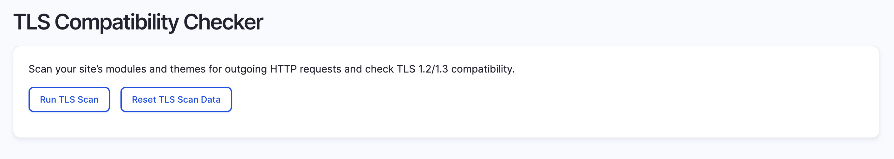

# Drupal TLS Compatibility Checker

[](https://docs.pantheon.io/oss-support-levels#unofficial-support)
[](https://github.com/jazzsequence/drupal_tls_checker/actions/workflows/lint.yml)


- Stable tag: 1.0.0

A scanner for outgoing HTTP requests in Drupal code to check TLS 1.2/1.3 compatibility.

## Installation

### Via Composer

```bash
composer require jazzsequence/drupal_tls_checker
```

### Manual Installation

1. Download the module from the [GitHub repository](https://github.com/jazzsequence/drupal_tls_checker).
2. Extract the downloaded archive.
3. Upload the extracted folder to the `modules/custom` directory of your Drupal installation.
4. Navigate to the **Extend** page in your Drupal admin panel (`/admin/modules`).
5. Find the **TLS Compatibility Checker** module in the list and enable it.
6. Click the **Install** button.

## Usage

There are two ways to use the TLS Checker: via the Drupal admin or via Drush. The module adds a TLS Compatibility Checker page to `/admin/config/development/tls-checker`. This page allows you to run a TLS scan on your site against `/modules` and `/themes` and all subdirectories (including `/contrib` and `/custom`). When the scan is complete, a list of URLs that are not compatible with TLS 1.2 or higher will be displayed.



You can also run the scan using the [Drush command described below](#drush-commands). 

In either case, both _passing_ and _failing_ urls are stored to the database. Subsequent scans will automatically _skip_ the TLS check for URLs that are known to have passed previously (while still testing URLs that were previously failing). This data can be reset at any time either by using the `tls-checker:reset` command from Drush or in the admin with the "Reset TLS Scan Data" button.

After a scan has been run, if there are any URLs detected that fail the TLS 1.2/1.3 check, an alert will be displayed on the admin page with a list of the failing URLs.

## Drush Commands

### `scan`

Runs the TLS checker scan across all PHP files in the given directories (defaults to `/modules` and `/themes`). You can specify a directory by passing a `--directory` flag, e.g.:

```bash
drush tls-checker:scan --directory=/modules/custom
```

#### Examples

```bash
drush tls-checker:scan
```

```bash
drush tls-checker:scan --directory=/private/scripts/quicksilver
```

Or, in a Pantheon environment using Terminus:

```bash
terminus drush -- <site>.<env> tls-checker:scan
```

### `report`

Returns a full report of checked URLs and whether they passed or failed the TLS check. Supports multiple formats (table, JSON, CSV, YAML).

#### Examples

```bash
drush tls-checker:report
```

```bash
drush tls-checker:report --format=json | jq
```

```bash
drush tls-checker:report --format=csv
```

Or, in a Pantheon environment using Terminus:

```bash
terminus drush -- <site>.<env> tls-checker:report
```


### `reset`

Resets the stored passing and failing URLs so the next scan will re-check all discovered URLs.

#### Examples
```bash
drush tls-checker:reset
```

```bash
terminus drush -- <site>.<env> tls-checker:reset
```

## How do I know it worked?
If the scan doesn't find anything bad, you should be good to go. If it does, it will list the URLs that it found that weren't compatible. However, if you want to validate that it's working, you can create a new module with the following code:

```php
<?php

namespace Drupal\tls_checker_test\Service;

use GuzzleHttp\Client;
use GuzzleHttp\Exception\RequestException;

/**
 * Service to test TLS requests.
 */
class TLSCheckerTestService {

  /**
   * Performs a request against a known bad TLS URL.
   */
  public function testTLSRequest() {
    $client = new Client([
      'verify' => TRUE, // Enforce TLS certificate verification
      'timeout' => 5,
    ]);

    try {
      $response = $client->get('https://tls-v1-1.badssl.com:1011/');
      return [
        'status' => 'success',
        'code' => $response->getStatusCode(),
        'body' => $response->getBody()->getContents(),
      ];
    }
    catch (RequestException $e) {
      return [
        'status' => 'error',
        'message' => $e->getMessage(),
      ];
    }
  }
}
```